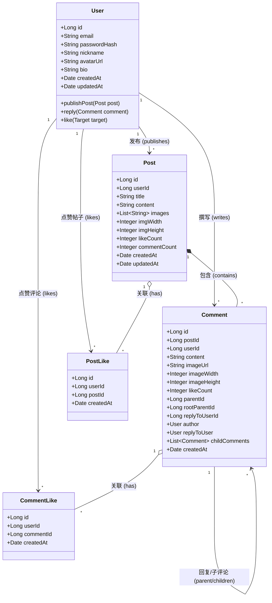

# RedNote 项目代码框架文档

## 1. 项目概览

本项目采用经典的 **前后端分离** 架构：

- **Android 客户端 (`app`)**: 基于 MVVM 架构，使用 Kotlin 语言开发。
- **Java 后端 (`java-backend`)**: 基于 Spring Boot 框架，采用分层架构（Controller-Service-Mapper）。

---

## 2. Android 客户端架构 (`app`)

### 2.1 技术栈

- **语言**: Kotlin
- **架构模式**: MVVM (Model-View-ViewModel)
- **构建工具**: Gradle (Kotlin DSL)

### 2.2 目录结构 (`com.rednote`)

```text
app/src/main/java/com/rednote/
├── data/                           # 数据层
│   ├── api/                        # 网络接口定义
│   │   ├── AuthInterceptor.kt      # Token 拦截器
│   │   ├── RetrofitClient.kt       # Retrofit 实例配置
│   │   ├── LoginApiService.kt      # 登录/注册接口
│   │   ├── PostApiService.kt       # 帖子相关接口
│   │   ├── CommentApiService.kt    # 评论相关接口
│   │   └── UserApiService.kt       # 用户信息接口
│   ├── db/                         # 本地数据库 (Room)
│   ├── model/                      # 数据模型 (Entity/Response)
│   │   ├── BaseResponse.kt         # 通用响应封装
│   │   ├── login/                  # 登录模块模型 (LoginRequest, etc.)
│   │   ├── post/                   # 帖子模块模型 (PostDetail, FeedItem)
│   │   └── comment/                # 评论模块模型
│   └── repository/                 # 仓库层 (数据源协调)
│       ├── LocationRepository.kt
│       └── WeatherRepository.kt
│
├── ui/                             # 界面层
│   ├── base/                       # 基础组件
│   │   ├── BaseActivity.kt         # Activity 基类 (处理 Loading, Toast)
│   │   ├── BaseFragment.kt         # Fragment 基类
│   │   └── BaseViewModel.kt        # ViewModel 基类 (协程异常处理)
│   ├── login/                      # 登录注册流程
│   │   ├── LoginActivity.kt        # 登录页容器
│   │   ├── LoginFragment.kt        # 登录表单
│   │   └── RegisterFragment.kt     # 注册表单
│   ├── main/                       # 主界面
│   │   ├── MainActivity.kt         # 底部导航容器
│   │   ├── home/                   # 首页 Feed 流
│   │   ├── message/                # 消息页
│   │   ├── mine/                   # 个人中心
│   │   └── weather/                # 天气组件
│   ├── detail/                     # 帖子详情页
│   │   ├── PostDetailActivity.kt   # 详情页入口
│   │   ├── PostDetailViewModel.kt  # 详情页逻辑
│   │   ├── CommentAdapter.kt       # 评论列表适配器
│   │   └── CommentInputDialog.kt   # 评论输入弹窗
│   ├── publish/                    # 发布模块
│   │   ├── AddActivity.kt          # 发布页
│   │   ├── ImageSelectorActivity.kt# 图片选择器
│   │   └── PublishViewModel.kt     # 发布逻辑
│   └── widget/                     # 自定义 View
│
├── utils/                          # 工具类
│   ├── FeedViewPool.kt             # RecyclerView 复用池
│   ├── DraftManager.kt             # 草稿管理
│   ├── PostUploadManager.kt        # 帖子上传管理
│   └── UserManager.kt              # 用户会话管理
│
└── RedNoteApp.kt                   # 全局 Application (初始化 SDK 等)
```

### 2.3 核心模块说明

- **UI Layer**: 每个功能模块（如 `login`, `main`）通常包含对应的 `Activity`/`Fragment` 和 `ViewModel`。`ViewModel` 负责持有 UI 状态并与 `Repository` 交互。
- **Data Layer**: `Repository` 屏蔽了数据来源的差异，UI 层只需调用 Repository 的方法即可获取数据（如 `PostRepository.getFeedList()`）。

---

## 3. Java 后端架构 (`java-backend`)

### 3.1 技术栈

- **语言**: Java
- **框架**: Spring Boot
- **ORM**: MyBatis-Plus
- **构建工具**: Maven
- **数据库**: MySQL
- **对象存储**: Aliyun OSS

### 3.2 目录结构 (`com.rednote`)

```text
java-backend/src/main/java/com/rednote/
├── common/                     # 通用模块 (常量, 全局异常处理, 通用返回对象)
├── config/                     # 配置类 (WebMvc, Swagger, Mybatis 配置)
├── controller/                 # 控制层：处理 HTTP 请求
│   ├── UserController.java     # 用户相关 (登录, 注册, 信息修改)
│   ├── PostController.java     # 帖子相关 (发布, 列表, 详情)
│   ├── CommentController.java  # 评论相关
│   └── CommonController.java   # 通用接口 (如文件上传)
│
├── service/                    # 业务逻辑层
│   ├── impl/                   # 业务逻辑实现类
│   └── [Interfaces]            # 业务接口定义
│
├── mapper/                     # 数据访问层 (DAO/Mapper 接口)
│
├── entity/                     # 实体类
│   ├── dto/                    # 数据传输对象 (接收前端参数)
│   ├── vo/                     # 视图对象 (返回前端数据)
│   └── [POJO]                  # 数据库映射对象
│
├── interceptor/                # 拦截器 (如 JWT 认证拦截)
└── utils/                      # 工具类 (JWT, 加密, OSS 工具等)
```

### 3.3 核心流程

1. **Request**: 前端发送 HTTP 请求到 `Controller`。
2. **Interceptor**: 请求经过 `Interceptor` 进行鉴权（如 Token 验证）。
3. **Controller**: `Controller` 接收参数（DTO），调用 `Service` 处理业务。
4. **Service**: `Service` 执行核心业务逻辑，通过 `Mapper` 访问数据库。
5. **Mapper**: `Mapper` 执行 SQL 语句，返回实体对象。
6. **Response**: `Service` 将结果封装为 VO，`Controller` 返回统一格式的 JSON 响应。

---

## 3.4 数据库设计 (Schema)

以下是核心业务表的 SQL 定义：

```sql
-- 用户表
CREATE TABLE IF NOT EXISTS `users` (
  `id` BIGINT UNSIGNED NOT NULL AUTO_INCREMENT COMMENT '用户ID',
  `email` VARCHAR(128) NOT NULL COMMENT '邮箱',
  `password_hash` VARCHAR(255) NOT NULL COMMENT '加密后的密码',
  `nickname` VARCHAR(64) NOT NULL DEFAULT '.' COMMENT '昵称',
  `avatar_url` VARCHAR(512) DEFAULT '' COMMENT '头像链接',
  `bio` VARCHAR(255) DEFAULT '暂时还没有简介' COMMENT '个人简介(小红书的签名)',
  `created_at` DATETIME NOT NULL DEFAULT CURRENT_TIMESTAMP COMMENT '注册时间',
  `updated_at` DATETIME NOT NULL DEFAULT CURRENT_TIMESTAMP ON UPDATE CURRENT_TIMESTAMP COMMENT '更新时间',
  PRIMARY KEY (`id`),
  UNIQUE KEY `idx_email` (`email`) USING BTREE COMMENT '邮箱必须唯一'
) ENGINE=InnoDB DEFAULT CHARSET=utf8mb4 COMMENT='用户表';

-- 帖子/笔记表
CREATE TABLE IF NOT EXISTS `posts` (
  `id` BIGINT UNSIGNED NOT NULL AUTO_INCREMENT COMMENT '帖子ID',
  `user_id` BIGINT UNSIGNED NOT NULL COMMENT '作者ID',
  `title` VARCHAR(100) NOT NULL DEFAULT '' COMMENT '标题(小红书标题通常较短)',
  `content` TEXT COMMENT '正文内容',
  `images` JSON COMMENT '图片URL集合，JSON数组格式 ["url1", "url2"]',
  `like_count` INT UNSIGNED NOT NULL DEFAULT '0' COMMENT '点赞数',
  `comment_count` INT UNSIGNED NOT NULL DEFAULT '0' COMMENT '评论数',
  `created_at` DATETIME NOT NULL DEFAULT CURRENT_TIMESTAMP COMMENT '发布时间',
  `updated_at` DATETIME NOT NULL DEFAULT CURRENT_TIMESTAMP ON UPDATE CURRENT_TIMESTAMP,
  PRIMARY KEY (`id`),
  KEY `idx_user_id` (`user_id`) USING BTREE COMMENT '用于查找某人的所有帖子',
  KEY `idx_created_at` (`created_at`) USING BTREE COMMENT '用于首页按时间流推荐'
) ENGINE=InnoDB DEFAULT CHARSET=utf8mb4 COMMENT='帖子/笔记表';

-- 评论表
CREATE TABLE IF NOT EXISTS `comments` (
  `id` BIGINT UNSIGNED NOT NULL AUTO_INCREMENT COMMENT '评论ID',
  `post_id` BIGINT UNSIGNED NOT NULL COMMENT '所属帖子ID',
  `user_id` BIGINT UNSIGNED NOT NULL COMMENT '评论者ID',
  `content` VARCHAR(1024) NOT NULL DEFAULT '' COMMENT '评论内容',
  `like_count` INT UNSIGNED NOT NULL DEFAULT '0' COMMENT '点赞数',
  `parent_id` BIGINT UNSIGNED DEFAULT NULL COMMENT '直接父评论ID (回复了谁)',
  `root_parent_id` BIGINT UNSIGNED DEFAULT NULL COMMENT '顶级根评论ID (为了快速聚合楼中楼)',
  `reply_to_user_id` BIGINT UNSIGNED DEFAULT NULL COMMENT '被回复的用户ID (方便前端显示 "回复 @某某")',
  `image_url` VARCHAR(512) DEFAULT NULL COMMENT '评论图片URL',
  `image_width` INT UNSIGNED DEFAULT 0 COMMENT '图片宽度',
  `image_height` INT UNSIGNED DEFAULT 0 COMMENT '图片高度',
  `created_at` DATETIME NOT NULL DEFAULT CURRENT_TIMESTAMP,
  PRIMARY KEY (`id`),
  KEY `idx_post_id` (`post_id`) USING BTREE COMMENT '查询某帖子的评论',
  KEY `idx_root_parent` (`root_parent_id`) USING BTREE COMMENT '查询某根评论下的所有回复'
) ENGINE=InnoDB DEFAULT CHARSET=utf8mb4 COMMENT='评论表';

-- 帖子点赞记录表
CREATE TABLE IF NOT EXISTS `post_likes` (
  `id` BIGINT UNSIGNED NOT NULL AUTO_INCREMENT,
  `user_id` BIGINT UNSIGNED NOT NULL COMMENT '点赞的用户ID',
  `post_id` BIGINT UNSIGNED NOT NULL COMMENT '被点赞的帖子ID',
  `created_at` DATETIME NOT NULL DEFAULT CURRENT_TIMESTAMP,
  PRIMARY KEY (`id`),
  UNIQUE KEY `uk_user_post` (`user_id`, `post_id`), 
  KEY `idx_post_id` (`post_id`)
) ENGINE=InnoDB DEFAULT CHARSET=utf8mb4 COMMENT='帖子点赞记录表';

-- 评论点赞记录表
CREATE TABLE IF NOT EXISTS `comment_likes` (
  `id` BIGINT UNSIGNED NOT NULL AUTO_INCREMENT,
  `user_id` BIGINT UNSIGNED NOT NULL COMMENT '点赞的用户ID',
  `comment_id` BIGINT UNSIGNED NOT NULL COMMENT '被点赞的评论ID',
  `created_at` DATETIME NOT NULL DEFAULT CURRENT_TIMESTAMP,
  PRIMARY KEY (`id`),
  UNIQUE KEY `uk_user_comment` (`user_id`, `comment_id`), 
  KEY `idx_comment_id` (`comment_id`)
) ENGINE=InnoDB DEFAULT CHARSET=utf8mb4 COMMENT='评论点赞记录表';
```

---

## 4核心类图与模型



---

## 5. 交互协议

- **通信格式**: JSON
- **认证方式**: JWT (Header: Authorization)
- **API 风格**: RESTful 风格
